# 🌐 mimidns

mimidns is a minimal authoritative DNS server implementation in Go.
It parses DNS master zone files into ResourceRecord structs, then decodes DNS messages and replies with the correct records.

Perfect for learning how DNS really works at the packet level.

## How to run this project

### Prerequisites

+ Go 1.21+

+ A zone file (e.g., ./zones/example.com.zone)

+ dig (from bind9-dnsutils/bind-utils) and CLI tool for testing

```bash
# 1) Clone & prepare
git clone https://github.com/c0d_0x/mimidns
cd mimidns

# 2) run
go run ./cmd/mimidns

# 3) Build
make

# 4) Run the server
./mimidns -h # or

#OUTPUT:
 # Usage of ./mimidns:
  # -p string
        # specify the port to run the server (default "3000")
  # -zones string
        # <path> specify zones' directory (default "zones")
```
## ✨ Features

Parse zone/master files into Go structs.

Handle DNS Header, Query, Answer sections.

Reply to client requests with matching records.

Lightweight, hackable, and easy to extend.

## 📖 How It Works

### 1. Parse Zone Files → Resource Records

Zone files (master files) are converted into this internal structure:

```go
type ResourceRecord struct {
    Name string
    TTL int
    Class string
    Type string
    RData []string
}

```

### 2. Parse DNS Messages

Incoming messages are decoded into headers, questions, and answers.

```go
 //Header
type Header struct {
    ID uint16
    FLAG [2]byte
    QDCOUNT uint16
    ANCOUNT uint16
    NSCOUNT uint16
    ARCOUNT uint16
}

//Question
type Query struct {
    NAME string
    TYPE MessageType
    CLASS MessageClass
}

// Answer
type Answer struct {
    NAME string
    TYPE MessageType
    CLASS MessageClass
    TTL uint32
    RDLENGTH uint16
    RDATA []string
}

// Full Message
type Message struct {
    MHeader Header
    Question []Query
    Answer []Answer
    Authority []Answer
    Additional []Answer
}

```

## 🛠️ Usage

### 1. Example Zone File (example.com.zone)

```zone
   $ORIGIN example.com.
   $TTL 3600
   @ IN A 192.0.2.1
   @ IN NS ns1.example.com.
```

### 2. Run mimidns

Load the zone file, listen for queries, and serve responses.

### 3. Query Your Server with dig

```bash
dig @127.0.0.1 -p 5353 example.com A

#Response should return:
example.com. 3600 IN A 192.0.2.1

```

## 📊 Example Flow

Here’s how a typical DNS query travels through mimidns:

```mermaid
sequenceDiagram
participant Client
participant mimidns
participant ZoneFile

    Client->>mimidns: Query (A example.com)
    mimidns->>ZoneFile: Lookup ResourceRecord
    ZoneFile-->>mimidns: example.com → 192.0.2.1
    mimidns-->>Client: DNS Response (Answer: 192.0.2.1)
```




## 🤝 Contributing

This project is built as a learning tool first.
Feel free to fork, experiment, and open issues or PRs!
